# 8. Entity-Relationship Diagram

## 8.1 High-Level ERD (Mermaid)

```mermaid
erDiagram
    TENANTS ||--o{ BRANCHES : has
    TENANTS ||--o{ USERS : employs
    BRANCHES ||--o{ USERS : staffed_by
    USERS ||--o{ USER_ROLES : assigned
    ROLES ||--o{ USER_ROLES : grants
    ROLES ||--o{ ROLE_PERMISSIONS : has
    PERMISSIONS ||--o{ ROLE_PERMISSIONS : includes

    TENANTS ||--o{ PRODUCTS : catalogs
    PRODUCT_CATEGORIES ||--o{ PRODUCTS : categorizes
    BRANCHES ||--o{ BRANCH_INVENTORY : stocks
    PRODUCTS ||--o{ BRANCH_INVENTORY : tracked_in
    PRODUCTS ||--o{ INVENTORY_LEDGER : moves
    BRANCHES ||--o{ INVENTORY_LEDGER : records

    PRODUCTS ||--o{ GALLON_TYPES : "container type of"
    GALLON_TYPES ||--o{ GALLONS : "instances of"
    GALLONS ||--o{ GALLON_STATUS_HISTORY : "status changes"
    GALLONS ||--o{ GALLON_CLEANING_RECORDS : "cleaned via"
    GALLONS ||--o{ GALLON_INSPECTIONS : "inspected via"
    GALLONS ||--o{ GALLON_FILL_LOGS : "filled via"
    GALLONS ||--o{ CONTAINER_MOVEMENTS : "moves via"
    BRANCHES ||--o{ GALLONS : "held at"

    BRANCHES ||--o{ PRODUCTION_BATCHES : produces
    PRODUCTS ||--o{ PRODUCTION_BATCHES : "output of"
    BRANCHES ||--o{ STOCK_TRANSFERS : "origin/destination"
    STOCK_TRANSFERS ||--o{ STOCK_TRANSFER_ITEMS : contains
    BRANCHES ||--o{ STOCK_COUNT_SESSIONS : conducts
    STOCK_COUNT_SESSIONS ||--o{ STOCK_COUNT_ITEMS : contains

    BRANCHES ||--o{ EQUIPMENT : owns
    EQUIPMENT ||--o{ MAINTENANCE_LOGS : "serviced via"
    USERS ||--o{ MAINTENANCE_LOGS : performs

    TENANTS ||--o{ CUSTOMERS : registers
    BRANCHES ||--o{ CUSTOMERS : "home branch"
    CUSTOMERS ||--o{ CUSTOMER_ADDRESSES : has
    CUSTOMERS ||--o{ CUSTOMER_TAGS : tagged
    CUSTOMERS ||--o{ CUSTOMER_CONTAINER_BALANCES : holds
    PRODUCTS ||--o{ CUSTOMER_CONTAINER_BALANCES : "container type"
    CUSTOMERS ||--o{ CUSTOMER_COMPLAINTS : files
    CUSTOMERS ||--o{ LOYALTY_TRANSACTIONS : earns
    LOYALTY_TIERS ||--o{ CUSTOMERS : "defines tier for"
    LOYALTY_REWARDS ||--o{ LOYALTY_TRANSACTIONS : "redeemed via"

    CUSTOMERS ||--o| RESELLERS : "is a"
    RESELLERS ||--o{ RESELLER_CONSIGNMENTS : holds
    PRODUCTS ||--o{ RESELLER_CONSIGNMENTS : consigned

    BRANCHES ||--o{ SHIFTS : operates
    USERS ||--o{ SHIFTS : works
    SHIFTS ||--o{ SALES_TRANSACTIONS : contains
    BRANCHES ||--o{ SALES_TRANSACTIONS : records
    CUSTOMERS ||--o{ SALES_TRANSACTIONS : "purchased by"
    SALES_TRANSACTIONS ||--o{ SALES_TRANSACTION_ITEMS : contains
    PRODUCTS ||--o{ SALES_TRANSACTION_ITEMS : sold
    SALES_TRANSACTIONS ||--o{ SALES_TRANSACTION_CONTAINER_EXCHANGES : involves
    SALES_TRANSACTIONS ||--o{ SALES_TRANSACTION_VOIDS : "void history"
    GALLONS ||--o{ SALES_TRANSACTION_CONTAINER_EXCHANGES : "exchanged via"

    CUSTOMERS ||--o{ DELIVERY_ORDERS : places
    CUSTOMER_ADDRESSES ||--o{ DELIVERY_ORDERS : "delivered to"
    USERS ||--o{ DELIVERY_ORDERS : "assigned rider"
    DELIVERY_ORDERS ||--o{ DELIVERY_ORDER_ITEMS : contains
    DELIVERY_ORDERS ||--o| SALES_TRANSACTIONS : "billed as"
    CUSTOMERS ||--o{ STANDING_ORDERS : subscribes
    STANDING_ORDERS ||--o{ STANDING_ORDER_ITEMS : contains
    BRANCHES ||--o{ DELIVERY_ROUTES : plans
    USERS ||--o{ DELIVERY_ROUTES : "assigned to"
    DELIVERY_ROUTES ||--o{ ROUTE_STOPS : contains
    DELIVERY_ORDERS ||--o{ ROUTE_STOPS : "stop for"
    DELIVERY_ORDERS ||--o{ DELIVERY_PROOFS : "proof of"
    USERS ||--o{ RIDER_SHIFTS : works

    SALES_TRANSACTIONS ||--o{ PAYMENTS : "paid via"
    CUSTOMERS ||--o{ PAYMENTS : "account payment"
    CUSTOMERS ||--o{ CUSTOMER_STATEMENTS : receives
    CUSTOMERS ||--o{ CUSTOMER_LEDGER : "ledger of"
    CUSTOMERS ||--o{ CONTAINER_DEPOSITS : deposits
    CUSTOMERS ||--o{ REFUNDS : receives
    CUSTOMERS ||--o{ INSTALLMENT_PLANS : has
    INSTALLMENT_PLANS ||--o{ INSTALLMENTS : contains
    PAYMENTS ||--o{ RECONCILIATION_ENTRIES : matched via
    BANK_STATEMENTS ||--o{ RECONCILIATION_ENTRIES : contains
    BRANCHES ||--o{ CASH_TRANSACTIONS : records
    BRANCHES ||--o{ EXPENSES : incurs

    TENANTS ||--o{ SUPPLIERS : has
    SUPPLIERS ||--o{ PURCHASES : supplies
    PURCHASES ||--o{ PURCHASE_ITEMS : contains
    PRODUCTS ||--o{ PURCHASE_ITEMS : "purchased via"

    TENANTS ||--o{ NOTIFICATIONS : sends
    USERS ||--o{ NOTIFICATIONS : receives
    CUSTOMERS ||--o{ NOTIFICATIONS : receives
    TENANTS ||--o{ SETTINGS : configures
    TENANTS ||--o{ AUDIT_LOGS : tracks
    USERS ||--o{ AUDIT_LOGS : performs
    TENANTS ||--o{ BACKUPS : schedules
    TENANTS ||--o{ INTEGRATIONS : connects
    INTEGRATIONS ||--o{ WEBHOOKS : triggers
    TENANTS ||--o{ REPORT_SCHEDULES : schedules
    TENANTS ||--o{ EXPORT_JOBS : requests
```

## 8.2 Relationship Catalog (Cardinality & Description)

| Relationship | Cardinality | Description |
|---|---|---|
| Tenant → Branches | 1:N | A tenant (company) owns multiple branches. |
| Tenant → Users | 1:N | All users belong to a tenant. |
| Branch → Users | 1:N | Staff assigned to a specific branch (nullable for HQ-level Owner). |
| User → Roles | M:N (via user_roles) | A user can hold multiple roles, optionally scoped to a branch. |
| Role → Permissions | M:N (via role_permissions) | Defines RBAC. |
| Product Category → Products | 1:N | Hierarchical categorization. |
| Branch → Branch Inventory | 1:N | Aggregate stock levels per branch per product. |
| Product → Containers | 1:N | A container-type product (e.g., "5-Gallon Round") has many individually tagged units. |
| Container → Container Movements | 1:N | Full audit trail of a single container's custody history. |
| Branch → Production Batches | 1:N | Each purification run belongs to a branch. |
| Stock Transfer → Stock Transfer Items | 1:N | Line items of a transfer. |
| Stock Count Session → Stock Count Items | 1:N | Line items of a physical count. |
| Equipment → Maintenance Logs | 1:N | Service history per machine/filter. |
| Customer → Customer Addresses | 1:N | Multiple delivery addresses. |
| Customer → Customer Container Balances | 1:N | Per container-type deposit balance. |
| Customer → Reseller | 1:1 (optional) | A customer record can be extended into a reseller profile. |
| Reseller → Reseller Consignments | 1:N | Stock placed on consignment. |
| Shift → Sales Transactions | 1:N | Transactions belong to a cashier shift. |
| Sales Transaction → Sales Transaction Items | 1:N | Line items sold. |
| Sales Transaction → Container Exchanges | 1:N | Container in/out per transaction. |
| Customer → Delivery Orders | 1:N | Orders placed by a customer. |
| Delivery Order → Delivery Order Items | 1:N | Items in the order. |
| Delivery Order → Sales Transaction | 1:1 (optional) | Once delivered/paid, links to the billing record. |
| Customer → Standing Orders | 1:N | Recurring order subscriptions. |
| Delivery Route → Route Stops | 1:N | Stops sequenced along a rider's route. |
| Sales Transaction → Payments | 1:N | Supports split payments. |
| Customer → Customer Ledger | 1:N | Full running-balance audit trail (sales, payments, deposits, adjustments). |
| Customer → Container Deposits | 1:N | Deposit charge/refund events. |
| Tenant → Notifications | 1:N | All notifications scoped to tenant for isolation. |
| Tenant → Audit Logs | 1:N | Full activity trail. |
| Product → Gallon Types | 1:N | A container-type product has a corresponding gallon type definition. |
| Gallon Type → Gallons | 1:N | Each gallon type has many individual gallon units. |
| Gallon → Gallon Status History | 1:N | Every status change is recorded for audit. |
| Gallon → Gallon Cleaning Records | 1:N | Each cleaning event is recorded. |
| Gallon → Gallon Inspections | 1:N | Each inspection event is recorded. |
| Gallon → Gallon Fill Logs | 1:N | Each fill event is recorded. |
| Customer → Reseller | 1:1 (optional) | A customer record can be extended into a reseller profile. |
| Reseller → Reseller Consignments | 1:N | Stock placed on consignment. |
| Customer → Customer Statements | 1:N | Periodic account statements. |
| Installment Plan → Installments | 1:N | Each plan has multiple installments. |
| Payment → Reconciliation Entry | 1:N | Payments are matched to bank statement lines. |
| Bank Statement → Reconciliation Entries | 1:N | Each statement has multiple reconciliation entries. |
| Delivery Order → Delivery Proof | 1:1 (optional) | Proof of delivery photo/signature. |
| Loyalty Tier → Customer | 1:N | Defines the tier for a customer. |
| Loyalty Reward → Loyalty Transaction | 1:N | Rewards are redeemed via loyalty transactions. |

## 8.3 Polymorphic Relationships (Handled via type+id columns, not native FK)

- `containers.current_holder_type/current_holder_id` → can reference `branches`, `customers`, `users` (riders), or `resellers`.
- `container_movements.from_holder_type/id` and `to_holder_type/id` → same polymorphic pattern.
- `notifications.user_id` (internal staff) vs `notifications.customer_id` (external) — mutually exclusive per row.

> **Design Note:** Polymorphic associations are implemented at the application layer with validated enum types for `*_type` columns, since native relational FKs cannot span multiple target tables. Referential integrity for these fields is enforced via application-level service checks and periodic consistency audit jobs.
